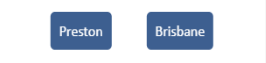

# 1. React Documentation

[Return to React Outline](0.Outline.md)

This section focuses on an overview of the entire codebase. 
Important components are also mentioned in this section.

## Table of Contents 


- [Page Structure Generics](#Page-Structure)
- [SCSS Styling](#SCSS-Styling)
- [Textfields](#Textfields)
    - [TextField](#TextField)
    - [Dropdown](#Dropdown)
    - [Select](#SelectButton)
    - [Toggle](#Toggle)
- [Containers](#Containers)
    - [Modal](#Modal)
    - [Popup](#Popup)
- [Configuration Files](#Configuration-Files)
- [Helper Functions](#Helper-Functions)
- [API Requests](#API=Request)

## Page Structure

Some screens use a template which provides the layout for those screens.
This allows the screens to have a consistent layout and layout changes can cleanly change across all relevant screens.
These templates can be found in the [screen folder](../../React/src/components/screen).

### Table Screen

The [TableScreen](../../React/src/components/screen/tableScreen.js) layout is designed for screens where the focal point 
is to display a table to the user. 


## SCSS Styling 

SCSS styling has been used so that large-scale colour changes can be quickly done across multiple pages. 
The **core** styling can be found in the [assets folder](../../React/src/assets).

- Main colour themes are found in the [_master file](../../React/src/assets/_master.scss).
- Modal layout such as column gap length is found in the [_modal file](../../React/src/assets/_modal.scss).
- General layout features such as centering with a screen is found in the [panel file](../../React/assets/panel.scss).

### General Approach 

Generally, CSS is applied in the following manner 

- A container is usually wrapped around an element for positioning using css grid or flexbox 
- Styling is applied to elements themselves when necessary


### Naming Convention 

The general naming convention is to name based off the general structure and adding extensions for particular features that may be needed for certain scenarios.

```css
    .modal-item {} /* Main structure */
    .modal-item--bottom {} /* CSS for particular structure instance */
```

### CSS Locations

CSS classes are generally found in the following locations:

- Most CSS classes are defined under the same filename under `.scss`. Eg. `modal.js` and `modal.scss`
- In the [assets](../../React/src/assets) directory

### Screen CSS 

Most screens have a similar structure, eg. displaying a table and header. 
Because of this, things such as table screens have a structure that every table screen uses. 
These screen structures are found in the [screen](../../React/src/components/screen) directory.

**Example Table Screen Structure**

```html 
    <div>
        <Header></Header>
        <div className='screen-container'>
            <div className='panel panel--table'>
                {props.table}
            </div>
        </div>
        {props.message}
        {props.modal}
    </div>
```

### Table CSS 

To find particular CSS in the [table](../../React/src/components/table/table.js), search for `className`.

The overall CSS structure can be described as:

- `table-full-container`: Overall Table CSS Container
- `table-container`: CSS for the table body
- CSS for table cells and table rows (in both headers and table body)

## Textfields

There are many available input fields that can be used for retrieving information from the user and are stored in [Fields](../../React/src/components/fields).

### TextField

The [TextField](../../React/src/components/fields/textfield.js) is a stylised `input` tag with the following features (by specifying parameter values):

- `restrictions`: restricts input values to certain patterns found in `patterns` in the file.
- Can be used in combination with the React hook [useInputState](4.Hooks.md#useInputState). Example usage found in the Hooks section.

### Dropdown

The [Dropdown](../../React/src/components/fields/dropdown.js) is a stylised `select` tag that also 

- includes an optional label that may be attached to the dropdown 
- can overwrite dropdown option names
- contains a default dropdown option of the form `Select {label.toLowerCase()}` where _label_ is a parameter argument

### SelectButton

The [SelectButton](../../React/src/components/fields/selectbutton.js) is used in the context of selecting an option from multiple options. 

<p align='center'>
 
</p>

This field involves:

- displaying each option in a list as a button, where clicking selects the button value
- optionally able to close a popup/modal when a button is clicked

### Toggle 

The [Toggle](../../React/src/components/fields/toggle.js) is used when a binary (eg. yes or no) value needs to be selected. 
This component can be used alongside the [useInputState](4.Hooks.md#useInputState) React hook.

There are also two help functions `booleanToOutput` and `outputToBoolean` which can be used to convert the field value into an appropriate format.


## Containers 

Some components are used to _contain_ forms or textfields or provide notifications. 
These components are found in the [Container File](../../React/src/components/containers) and contain:

- [Modal](#Modal): Form and submission button
- [Popup](#Popup): Form where selectng options closes the popup

### Modal 

The [Modal](../../React/src/components/containers/modal/modal.js) is predominately used for displaying forms in screens with tables. 
It is composed of a form (where you can include textfields) and a button to _submit_ the form. 

Notable features (parameters) include:

- `unrestrictWidth`: This allows for dynamic width of the modal (up to 85vw) for forms which expand horizontally. 
Otherwise, the modal width is restricted to 260px. These values can be changed in the associated [scss]
[../../React/src/components/containers/modal/modal.scss].
- `isLoading`: This specifies whether the form is _loading_ such as when a request is sent and a response is pending. 
This will change the submission button name from `buttonName` (parameter) to _loading_. 

**Note.** There is a helper function called `checkChange` in the [modal file](../../React/src/components/containers/modal/modal.js) that can be used to determine whether two Javascript objects are different.

### Popup

The [Popup](../../React/src/components/containers/popup/popup.js) is for when an option must be selected in order to close the popup.
This is used for setting the site.

An associated `PopupButton` in the same file can be used for opening the popup, although another button may also be used.


## Configuration Files

The coniguration file is found in the [.env file](../../React/.env).
This is used to configure the 

- SSRS URL
- Express URL

before building the application. 

To add variables to the configuration file, add a line of the form:

```javascript
    REACT_APP_VARIABLE_NAME = 'value'
```

This variable can be retrieved in any file using 

```javascript
    process.env.REACT_APP_VARIABLE_NAME // value
```

**Note.** The React application must be rebuilt each time the `.env` file changes.

## Helper Functions

There are helper functions that are used predominately for converting values into the correct format. 

- [Date Helpers](../../React/src/components/fields/dateHelpers.js): This contains functions for converting date related information into an appropriate format. More detail can be found in the [React Table Dates Section](3.React-Table.md#Dates).


## API Request

Requests are sent via the `axios` package. 
Referring to [api](../../React/src/components/api/api.js), the **withCredentials** parameter must be set to 'true`.
Otherwise, the session id will not be sent with the request and won't be recognised. 

To make requests to other APIs, add to the [api](../../React/src/components/api/api.js) in a similar fashion.


